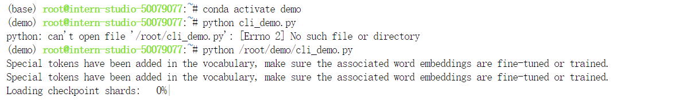
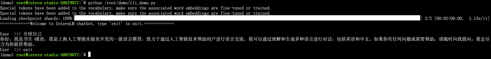
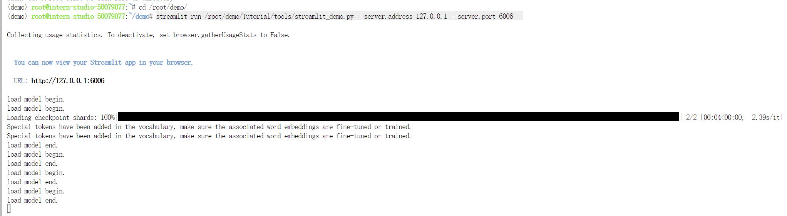
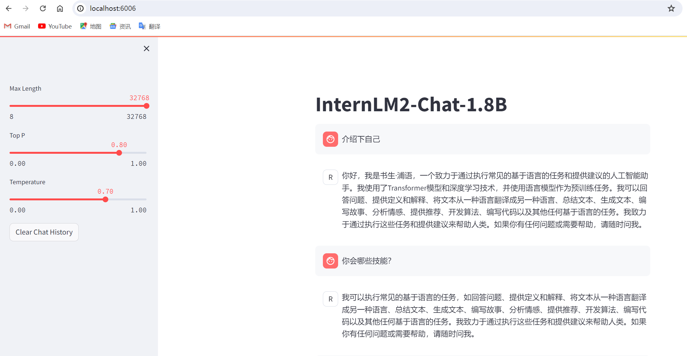
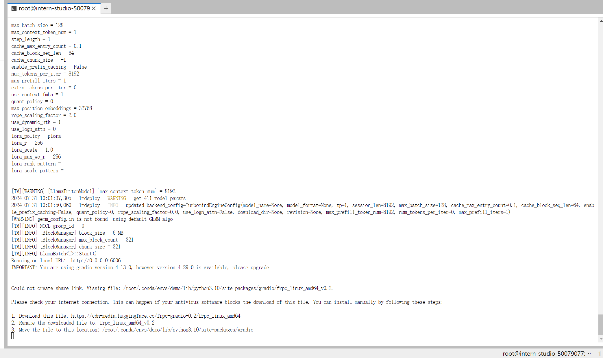
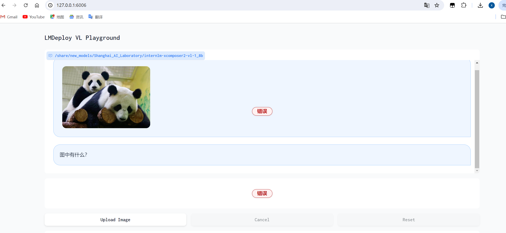
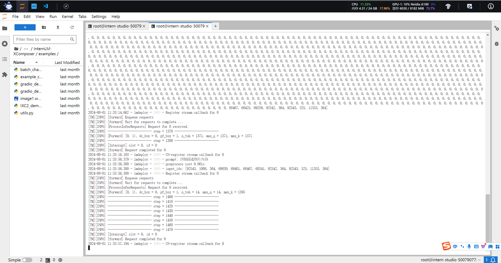
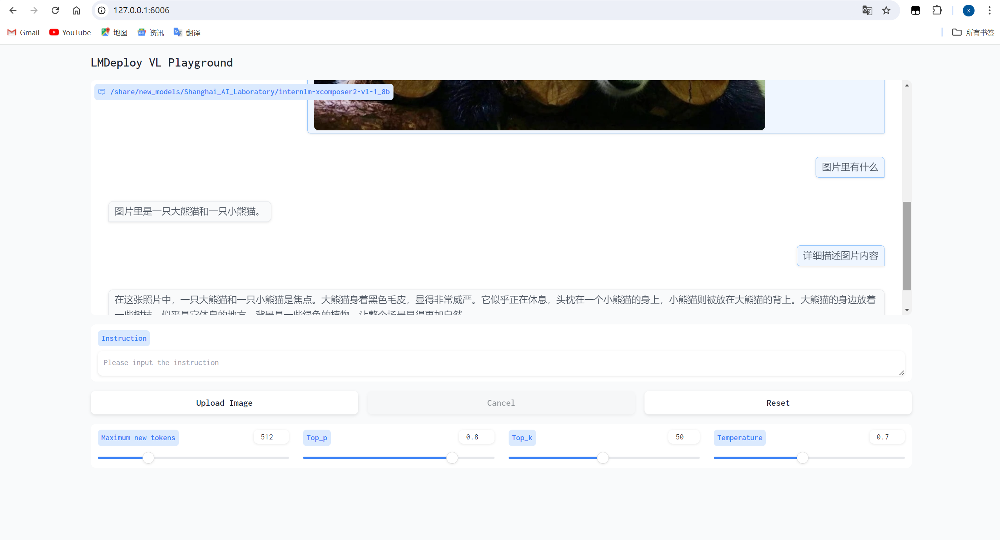
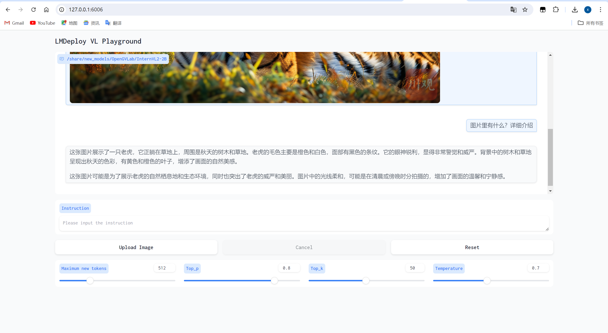

# 8G显存玩转书生大模型

基本实现任务：

1. InternLM2-Chat-1.8B 模型的部署（基础任务）
2. InternLM-XComposer2-VL-1.8B 模型的部署（进阶任务）
3. InternVL2-2B 模型的部署（进阶任务）

## 笔记

此文档可能步骤较快，有任何不明白的可直接私聊我或者给我留言，谢谢~

## Streamlit Web Demo 部署 InternLM2-Chat-1.8B 模型



这里其实往期文档包含更加详细的步骤：[书生浦语大模型第二期](https://github.com/Dstarjohn/SSPY-Demo2-Notes)，但是为了方便更多的同学们学习，这里我会继续在教程指定路径下带着大家一起再操作一遍。





```python
streamlit run /root/demo/Tutorial/tools/streamlit_demo.py --server.address 127.0.0.1 --server.port 6006
```


这里可能会出现`inotify` 的限制，由于都是docker镜像，无法设置`echo 1048576 | sudo tee /proc/sys/fs/inotify/max_user_watches`，所以建议换个时间段再来实操，或者直接联系开发机提供者。（博主这里直接换个时间来执行的命令）

然后就是打开本地Win+R，输入cmd然后输入：

```python
ssh -CNg -L 6006:127.0.0.1:6006 root@ssh.intern-ai.org.cn -p 你的 ssh 端口号
```

我这里是46264（自己在开发机——控制台——SSH连接，查看端口号），这里是没有任何response回应的，可能会有个warning警告吧，不用管，然后本机打开浏览器输入`127.0.0.1:6006`即可看到如下效果




## LMDeploy 部署 InternLM-XComposer2-VL-1.8B 模型

InternLM-XComposer2 是一款基于 InternLM2 的视觉语言大模型，其擅长自由形式的文本图像合成和理解。特点总结如下：

- 自由且高度定制化的文本图像内容合成：可参考大纲、详细文本和参考图作为输入，生成连贯且上下文相关的文章。

- 准确的视觉识别感知能力：基于自由形式的指令处理多样化的视觉问答任务，在识别、感知等视觉推理上表现出色。

- 性能卓越：基于 InternLM2-7B 的InternLM-XComposer2 在多个基准测试中位于开源多模态模型第一梯队，而且在部分基准测试中与 GPT-4V 和 Gemini Pro 相当甚至超过它们。

LMDeploy是一个用于压缩、部署和服务 LLM 的工具包，由 MMRazor 和 MMDeploy 团队开发，功能如下：

- 高效推理LMDeploy 通过引入持久化批处理、块 KV 缓存、动态分割与融合、张量并行、高性能 CUDA 内核等关键技术，提供了比 vLLM 高 1.8 倍的推理性能。
- 有效的量化：支持权重量化和KV量化，4bit的推理性能是FP16的2.4倍
- 分发：利用请求分发服务，LMDeploy可以在多台设备上高效的部署模型服务
- 交互式推理：通过缓存多轮对话的注意力的KV，推理引擎记住对话历史，从而避免重复处理历史会话。
- 优秀的兼容性：LMDeploy支持 KV Cache Quant，AWQ 和自动前缀缓存同时使用。

 LMDeploy 仅支持了 InternLM-XComposer2 系列模型的视觉对话功能，接下来就是实践步骤了。首先激活安装相关依赖

```python
conda activate demo
pip install lmdeploy[all]==0.5.1
pip install timm==1.0.7
```

然后使用LMDeploy启动Gradio服务，主要是为了和InternLM-XComposer2-VL-1.8b进行交互。

```python
lmdeploy serve gradio /share/new_models/Shanghai_AI_Laboratory/internlm-xcomposer2-vl-1_8b --cache-max-entry-count 0.1
```



和上面的本地SSH连接端口映射一样的步骤哈，请小伙伴们自己往上面滑一下看看

这里可能会出现环境的问题，导致如下效果：



这里说明下是什么问题，你在上传一张图片（任意），然后输入问题，回到jupyterLab看看代码会出现“**Aborted (core dumped)**”的报错显示，然后你的lmdeploy启动的gradio服务就断了。这里首先说明和GPU内存没有关系，和搭建的虚拟环境有关，小伙伴可以去看官方文档demo目录下提供的一个easy_readme.md文档哈，文档已经在 `/root/share/pre_envs` 中配置好了预置环境 `icamp3_demo`，他这个环境你再把InternLM-XComposer2-VL-1.8b启动就没问题，感兴趣的可以吧环境导出成yml看看，你会发现区别的。

这里将LMDeploy 部署 InternVL2-2B 模型的命令如下：

```python
conda activate demo
lmdeploy serve gradio /share/new_models/OpenGVLab/InternVL2-2B --cache-max-entry-count 0.1
```


正确的输出如下：



测试图片如下：


###### InternLM-XComposer2-VL-1.8B图文理解模型输出如下：



###### LMDeploy 部署 InternVL2-2B 模型图文理解模型输出如下：



## 总结

这个关卡主要还是集中在InternLM2-chat-1.8B和InternLM-XComposer2-VL-1.8B和
2B的模型部署，一个是chat文本对话模型，另一个是图文理解的模型、最后一个是多模态大模型的视线，本质上还是帮助我们去理解这几种模型的输入输出的特性和优势，方便我们对社区开源的模型有更深的理解。感兴趣的或者方向是这个的可以更加深入的去了解这几种模型的架构和实现方式，早在第二期就有详细的技术文档提供，可以参考我前面的笔记阅读。
